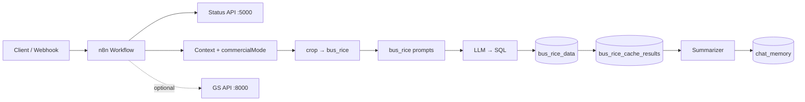

# Architecture

CropMonster orchestrates n8n agents with MySQL and optional backend HTTP services. The open-source demo uses **commercial rice** (`bus_rice_data`) only.

## Repository Layout

```text
cropmonster/
├── workflow/
├── prompts/bus_rice/      # Four-layer prompts (commercial rice)
├── schema/ddl/
├── data/bus_rice_data.sql
├── backend/
└── docs/
```

## Runtime Flow



## Tables

| Table | Role |
| --- | --- |
| `bus_rice_data` | Commercial variety records |
| `bus_rice_cache_results` | Query hit cache |
| `chat_memory` | Multi-turn session + SQL cache |
| `request_status` | UI progress (`status_api.py`) |

## Prompt mount paths (n8n `/data`)

| Layer | File |
| --- | --- |
| Control | `bus_rice_data.txt` |
| Analysis | `Mapping/bus_rice_mapping_data.txt` |
| Execution | `Prompt/bus_rice_score_prompt.txt`, `bus_rice_conditional_prompt.txt` |
| Interpretation | `Prompt/unit/bus_rice_unit.txt`, `rule/bus_rice_rule.txt` |
